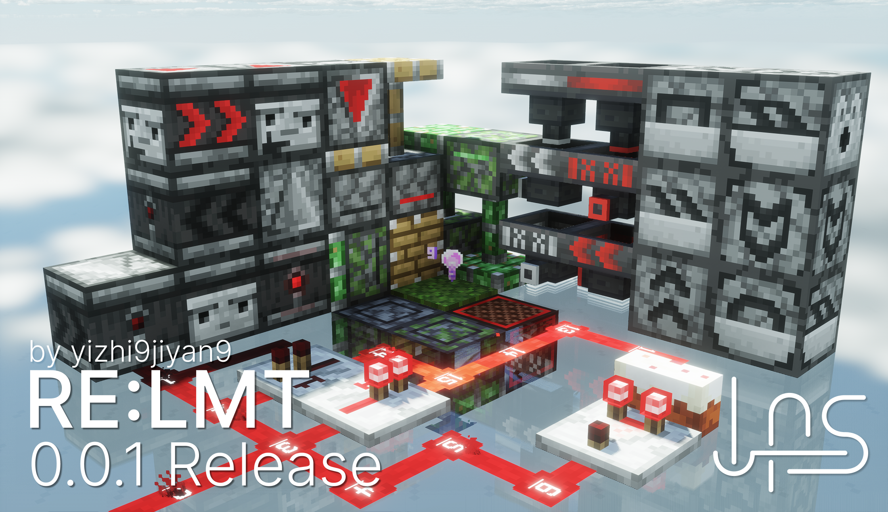

# 红量展信：外星科技 - RoFAlien
## 概述

这是一个红石显示资源包，致力于在保留原版风格的基础上使红石原件变得直观的显示运行状态。

## 支持版本

本资源包完全接管了原版的 blockstate，因此理论支持所有版本的游戏。  
> 不过像是一些比较基础的比如父级层次套娃套到 block/kube.json、block/block.json 这些也没完全接管所有父级，真不会有人改这玩意吧。

目前在 Minecraft 1.20.1 环境开发。
> 0.0.1r 及以前的版本在 1.20.4 环境开发

## 支持与反馈

官方 QQ 群为：1007632825

## 计划

<!--✅✏️⏸️-->
序号|内容|进度
-|-|-
#1|修复漏斗XO标反了的问题|✅
#2|修改投掷器与发射器侧面纹理|✏️
#3|添加红石灯|⏸️
#4|添加堆肥桶|✏️
#5|添加标靶|✏️
#6|添加炼药锅|未开始
#7|添加压力板|未开始
#8|添加按钮|未开始

## 协议与著作权声明

<a property="dct:title" rel="cc:attributionURL" href="https://github.com/LazyAlienServer/RoFAlien">RoFAlien</a> © 2025 by <a rel="cc:attributionURL dct:creator" property="cc:attributionName" href="https://github.com/yizhi9jiyan9">yizhi9jiyan9</a> is licensed under <a href="https://creativecommons.org/licenses/by-nc-sa/4.0/?ref=chooser-v1" target="_blank" rel="license noopener noreferrer" style="display:inline-block;">CC BY-NC-SA 4.0</a>

## 特别鸣谢
- 感谢 LazyAlienServer 所有成员为此项目的建议。
- 感谢 [阿卡迪亚](https://github.com/Arcadi4) 绘制的 LAS 图标
