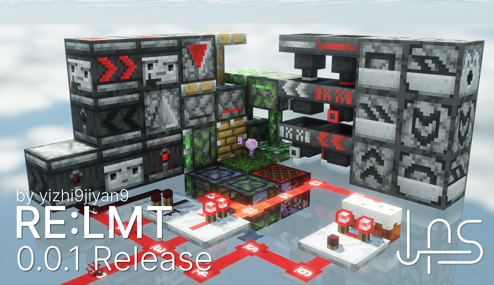

# 红量展信：外星科技 - RoFAlien
## 概述

这是一个红石显示资源包，致力于在保留原版风格的基础上使红石原件变得直观的显示运行状态。

<!--  -->

## 支持版本

本资源包完全接管了原版的 blockstate，因此理论支持所有版本的游戏。  
> 不过像是一些比较基础的比如父级层次套娃套到 block/kube.json、block/block.json 这些也没完全接管所有父级，真不会有人改这玩意吧。

目前在 Minecraft 1.20.1 环境开发。
> 0.0.1r 及以前的版本在 1.20.4 环境开发

## 支持与反馈

官方 QQ 群为：1007632825

## 构建资源包

项目使用 [ShulkerRDK](https://github.com/LiPolymer/ShulkerRDK) 从 `src/`
生成资源包。第一次使用时安装经过 SHA-256 校验的固定版本，然后构建：

```powershell
.\shulker\install.ps1
.\shulker\build.ps1
```

成品位于 `build/RoFAlien_0.0.2.zip`。`build/` 和
`shulker/local/` 都是本地生成目录，不应提交。工具版本与 SHA-256
记录在 [`shulker/TOOLS.md`](shulker/TOOLS.md)。

请始终使用 `shulker/build.ps1`，不要直接把 `srdk.exe build` 用作自动化
成功判据。B0.15 的 Aseprite 转换可能在主进程退出后继续写文件；包装脚本会
等待构建缓存的路径、长度和 SHA-256 连续稳定，再自行打包，并验证所有静态
资源、Aseprite 输出和资源包根文件均存在。

### 从一个 Aseprite 文件导出多张贴图

将 `.aseprite` 文件放在 `src/` 中最终贴图所在的位置。构建时源文件不会
进入 ZIP，ShulkerRDK 会根据图层名中的 `#标签` 合成 PNG：

| Aseprite 图层名 | 构建行为 |
| --- | --- |
| `外框` | 公共图层，包含在基础贴图和所有标签变体中 |
| `亮起#_on` | 只包含在 `_on` 变体中 |
| `共享细节#_on#_locked` | 同时包含在 `_on` 与 `_locked` 变体中 |
| `#disableBase` | 不生成无后缀的基础贴图 |

例如 `repeater.aseprite` 包含以下图层：

```text
底座
红石火把
亮起效果#_on
锁定效果#_locked
公共状态标记#_on#_locked
```

构建后会生成：

```text
repeater.png
repeater_on.png
repeater_locked.png
```

每个标签变体都是“无标签公共图层 + 当前标签图层”的合成结果。如果只想
生成带标签的贴图，请添加名为 `#disableBase` 的图层。标签建议统一使用
`#_后缀`，这样输出名称可直接对应 Minecraft 模型引用。当前转换器处理静态
贴图的第 1 帧，并忽略 Tilemap 图层；复杂动画、不同裁剪尺寸或组合式批量
变体应使用单独的导出脚本，而不要强行编码进标签。

## 计划表 - 0.0.3

<!--
进度：✅、✏️、⏸️、🤔、未开始、无计划
优先级：🟥🟨🟩
-->
序号|内容|进度|优先级
-|-|-|-
#1|重绘红石粉显示数字|未开始|🟨
#2|修改投掷器与发射器侧面箭头|未开始|🟨
#3|为细雪、熔岩炼药锅添加纹理|未开始|🟩
#4|修改堆肥桶、炼药锅、标靶显示数字|未开始|🟥
#5|重绘侦测器侧面纹理|未开始|🟨
#6|修改漏斗纹理|未开始|🟩

## 协议与著作权声明
<p xmlns:cc="http://creativecommons.org/ns#" xmlns:dct="http://purl.org/dc/terms/"><a property="dct:title" rel="cc:attributionURL" href="https://github.com/LazyAlienServer/RoFAlien">RoFAlien</a> © 2025 by <a rel="cc:attributionURL dct:creator" property="cc:attributionName" href="https://github.com/yizhi9jiyan9">yizhi9jiyan9</a> is licensed under <a href="https://creativecommons.org/licenses/by-nc-sa/4.0/?ref=chooser-v1" target="_blank" rel="license noopener noreferrer" style="display:inline-block;">CC BY-NC-SA 4.0</a></p>

## 特别鸣谢
- 感谢 LazyAlienServer 所有成员为此项目的建议；
- 感谢 RCY_QWQ 提供的建议；
- 感谢 [阿卡迪亚](https://github.com/Arcadi4) 绘制的 LAS 图标。
